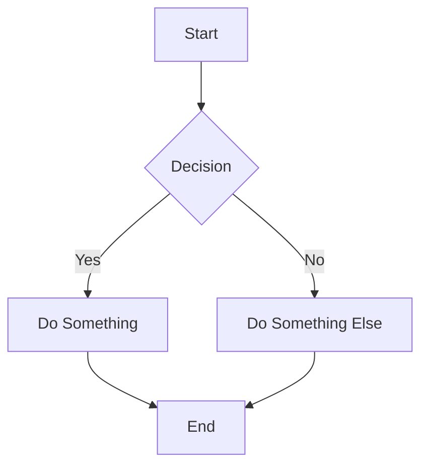
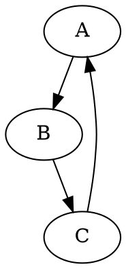

# BrowserMark

A simple, browser-based markdown to document converter that generates high-quality PDF, DOCX, and MHTML files directly in your browser.

## Live Demo

Try it out at: [https://browsermark.useast01.workers.dev/](https://browsermark.useast01.workers.dev/)

## Features

- **Live Preview**: See your markdown rendered in real-time as you type
- **Diagram Support**: Render technical diagrams using multiple diagramming languages:
  - **Mermaid** - Flowcharts, sequence diagrams, Gantt charts, and more
  - **Graphviz (DOT)** - Graphs and networks
  - **Nomnoml** - UML diagrams
  - **Pikchr** - PIC-like technical diagrams
  - **Error Handling**: Friendly error messages with detailed debugging information
  - **Loading Indicators**: Visual feedback while diagrams render
- **Multiple Export Formats**:
  - PDF (with customizable headers, footers, and page numbers)
  - DOCX (Microsoft Word compatible)
  - MHTML (single-file web archive)
- **Custom Options**:
  - Header and footer text
  - Page numbering
  - Link URL display (for print PDFs)
  - Word-style header colors
  - Font family selection
- **Custom Filenames**: Set custom filenames for your exports
- **Auto-Filename from Headers**: Automatically use the first heading as the filename

## Usage

1. Type or paste your markdown in the input panel
2. Use the options panel to customize headers, footers, and other settings
3. Set a custom filename if desired (or enable auto-filename from first header)
4. Click one of the export buttons to download your document

### Basic Markdown Example

```markdown
# My Document Title

This is a paragraph with **bold** and *italic* text.

## Features

- Bullet points
- [Links](https://example.com)
- `Code blocks`

> Blockquotes work too
```

### Diagram Examples

**Mermaid Flowchart:**
````markdown

````

**Graphviz (DOT) Graph:**
````markdown

````

**Nomnoml UML Diagram:**
````markdown
```nomnoml
[Customer]->[Order]
[Order]->[Product]
```
````

**Pikchr Technical Diagram:**
````markdown
```pikchr
box "Server"; arrow; box "Client"
```
````

## Deployment

This project is built for deployment on Cloudflare Workers.

### Prerequisites

- Node.js and npm
- Cloudflare account with Wrangler CLI installed

### Installation

1. Clone the repository:
   ```bash
   git clone https://github.com/yourusername/browsermark.git
   cd browsermark
   ```

2. Install dependencies:
   ```bash
   npm install
   ```

3. Deploy to Cloudflare Workers:
   ```bash
   npx wrangler deploy
   ```

### Local Development

To run locally for development:

```bash
npx wrangler dev
```

## Architecture

- **Frontend**: Pure HTML/CSS/JavaScript with no build process required
- **Libraries**:
  - [Marked](https://github.com/markedjs/marked) for markdown parsing
  - [html2pdf.js](https://github.com/eKoopmans/html2pdf.js) for PDF generation
  - [DocShift](https://github.com/oryan/html2docx) for DOCX generation
  - [Mermaid.js](https://mermaid.js.org/) for flowcharts and sequence diagrams
  - [Viz.js](https://github.com/mdaines/viz.js) for Graphviz DOT rendering
  - [Nomnoml](https://github.com/skanaar/nomnoml) for UML diagrams
  - [Pikchr](https://pikchr.org/) for PIC-like technical diagrams
- **Deployment**: Cloudflare Workers for global CDN hosting

## File Structure

```
src/
├── index.html          # Main application UI
├── app.js             # Application logic and event handlers
├── styles.css         # Styling and print CSS
├── pdf-generator.js   # PDF export functionality
├── docx-generator.js  # DOCX export functionality
└── mhtml-generator.js # MHTML export functionality
```

## Browser Support

Works in all modern browsers that support:
- ES6 modules
- File download APIs
- Canvas API (for PDF generation)

## Contributing

1. Fork the repository
2. Create a feature branch
3. Make your changes
4. Test thoroughly across different browsers
5. Submit a pull request

## License

MIT License

Copyright (c) 2026 zarguell

Permission is hereby granted, free of charge, to any person obtaining a copy of this software and associated documentation files (the "Software"), to deal in the Software without restriction, including without limitation the rights to use, copy, modify, merge, publish, distribute, sublicense, and/or sell copies of the Software, and to permit persons to whom the Software is furnished to do so, subject to the following conditions:

The above copyright notice and this permission notice shall be included in all copies or substantial portions of the Software.

THE SOFTWARE IS PROVIDED "AS IS", WITHOUT WARRANTY OF ANY KIND, EXPRESS OR IMPLIED, INCLUDING BUT NOT LIMITED TO THE WARRANTIES OF MERCHANTABILITY, FITNESS FOR A PARTICULAR PURPOSE AND NONINFRINGEMENT. IN NO EVENT SHALL THE AUTHORS OR COPYRIGHT HOLDERS BE LIABLE FOR ANY CLAIM, DAMAGES OR OTHER LIABILITY, WHETHER IN AN ACTION OF CONTRACT, TORT OR OTHERWISE, ARISING FROM, OUT OF OR IN CONNECTION WITH THE SOFTWARE OR THE USE OR OTHER DEALINGS IN THE SOFTWARE.
