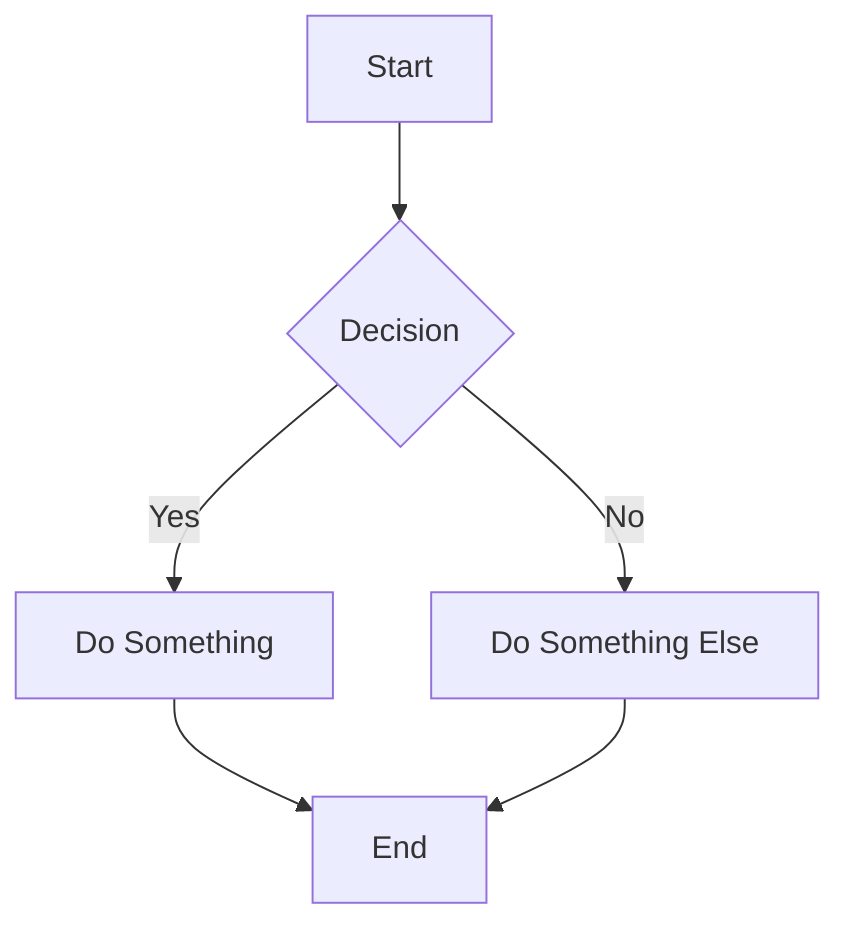
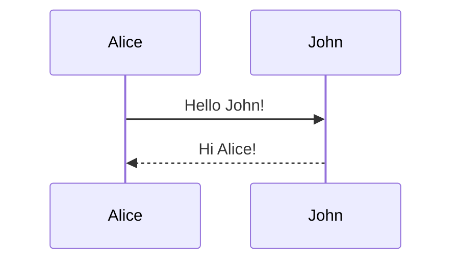
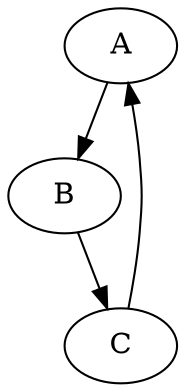
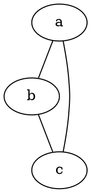

# Diagram Support in BrowserMark

BrowserMark supports rendering technical diagrams directly in your markdown documents using multiple diagramming libraries.

## Supported Diagram Languages

### 1. Mermaid.js

**Best for:** Flowcharts, sequence diagrams, Gantt charts, state diagrams, and more.

**Language identifier:** `mermaid`

**Examples:**





**Resources:**
- [Mermaid Documentation](https://mermaid.js.org/intro/)
- [Mermaid Syntax Reference](https://mermaid.js.org/intro/syntax-reference.html)

### 2. Graphviz (DOT)

**Best for:** Directed and undirected graphs, networks, trees.

**Language identifiers:** `dot` or `graphviz`

**Examples:**





**Resources:**
- [Graphviz Documentation](https://graphviz.org/documentation/)
- [DOT Language Guide](https://graphviz.org/doc/info/lang.html)

### 3. Nomnoml

**Best for:** UML class diagrams, simple diagrams with clean syntax.

**Language identifier:** `nomnoml`

**Examples:**

```nomnoml
[Customer]->[Order]
[Order]->[Product]
```

```nomnoml
[<frame>Architecture|
  [Frontend]-->[Backend]
  [Backend]-->[Database]
]
```

**Resources:**
- [Nomnoml GitHub](https://github.com/skanaar/nomnoml)
- [Nomnoml Reference](http://www.nomnoml.com/)

### 4. Pikchr

**Best for:** PIC-like technical diagrams, simple schematic diagrams.

**Language identifier:** `pikchr`

**Examples:**

```pikchr
box "Server"; arrow; box "Client"
```

```pikchr
circle "Start"; arrow; box "Process"; arrow; circle "End"
```

**Resources:**
- [Pikchr Documentation](https://pikchr.org/home/doc/trunk/doc/README.md)
- [Pikchr Examples](https://pikchr.org/home/doc/trunk/doc/examples.md)

## Features

### Error Handling

When diagram rendering fails, BrowserMark provides:

1. **User-friendly error messages** explaining what went wrong
2. **Error type detection**:
   - **Syntax errors**: Invalid diagram code
   - **Library load errors**: Network or CDN issues
   - **Timeout errors**: Diagram took too long to render
3. **Technical details** (collapsible) for debugging
4. **Diagram code display** to help identify issues

Example error display:
```
❌ Mermaid Diagram Error

The diagram syntax is invalid. Please check your diagram code for errors.

▼ Technical details
  Error Type: syntax_error
  Error Message: Syntax error in line 5

  Diagram code:
  graph TD
    A-->B
    B-->C  # This line has an error
```

### Loading States

While diagrams are rendering, you'll see:

- **Animated spinner** indicating progress
- **Loading message** showing which diagram type is being rendered
- **Automatic replacement** with the rendered diagram or error when complete

### Timeout Protection

Diagrams that take too long to render (default: 30 seconds) will automatically timeout with a friendly error message suggesting you simplify the diagram.

## Tips for Better Diagrams

### Mermaid

1. **Keep it simple** - Complex diagrams can be slow to render
2. **Use unique IDs** - If using subgraphs, give them unique names
3. **Check syntax** - Mermaid is picky about syntax; use the [live editor](https://mermaid.live/) to test

### Graphviz

1. **Use `dot` for directed graphs** - Use `dot` for most cases
2. **Use `graph` for undirected graphs** - When direction doesn't matter
3. **Label your edges** - Add labels with `A -> B [label="flows to"]`

### Nomnoml

1. **Simple syntax** - Nomnoml has very clean syntax for UML
2. **Use frames** - Frame boxes help organize complex diagrams
3. **Direction matters** - Arrows show direction clearly

### Pikchr

1. **PIC-like syntax** - If you know PIC, you know Pikchr
2. **Simple shapes** - Boxes, circles, lines, arrows
3. **Automatic positioning** - Pikchr handles spacing automatically

## Troubleshooting

### Diagram not rendering

1. **Check the language identifier** - Make sure you're using the correct fence:
   - Correct: ` ```mermaid `
   - Incorrect: ` ```Mermaid ` (case-sensitive in some parsers)

2. **Check for syntax errors** - Copy your diagram code into the library's official editor to verify

3. **Check internet connection** - Libraries are loaded from CDN

4. **Simplify the diagram** - Large or complex diagrams may timeout

### Diagram renders but looks wrong

1. **Check for missing quotes** - Text with spaces usually needs quotes
2. **Check arrow syntax** - Each library has different arrow syntax
3. **Try the live editor** - Most diagram libraries have online editors

### Export to PDF/DOCX issues

1. **SVG conversion** - Diagrams are converted to SVGs before export
2. **Inline styles** - BrowserMark applies inline styles for better compatibility
3. **Test in browser first** - Make sure diagrams render correctly before exporting

## Performance Considerations

- **Mermaid**: Can be slow for very large diagrams (100+ nodes)
- **Graphviz**: Generally fast, but complex layouts take time
- **Nomnoml**: Very fast for UML diagrams
- **Pikchr**: Fast for simple technical diagrams

**Tip:** If you have many diagrams in one document, consider splitting into multiple documents.

## Browser Compatibility

Diagram rendering requires:

- **Modern browser** with ES6+ support
- **JavaScript enabled**
- **Internet connection** (for loading diagram libraries from CDN)

Tested on:
- Chrome/Edge 90+
- Firefox 88+
- Safari 14+

## Limitations

1. **Client-side only** - Diagrams are rendered in your browser
2. **CDN dependency** - Libraries loaded from jsdelivr/unpkg CDNs
3. **Timeout** - Very complex diagrams may timeout (30s default)
4. **Export format** - Diagrams are embedded as SVG in exports

## Feedback and Issues

If you encounter issues with diagram rendering:

1. Check the error message for details
2. Try simplifying your diagram
3. Test your diagram code in the library's official editor
4. Report issues on [GitHub Issues](https://github.com/yourusername/browsermark/issues)
