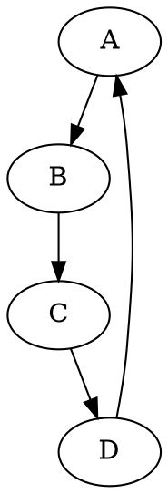
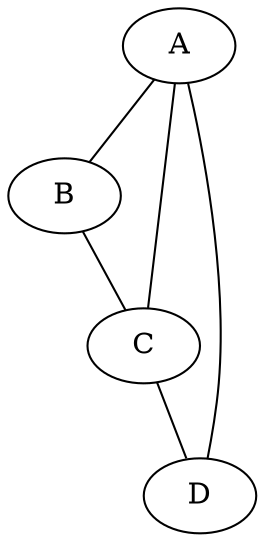
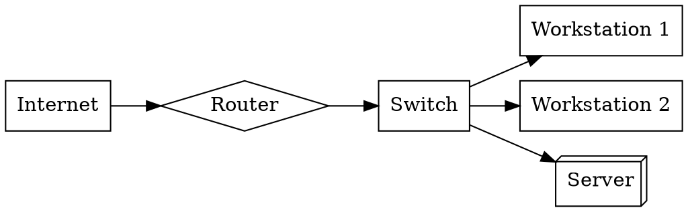
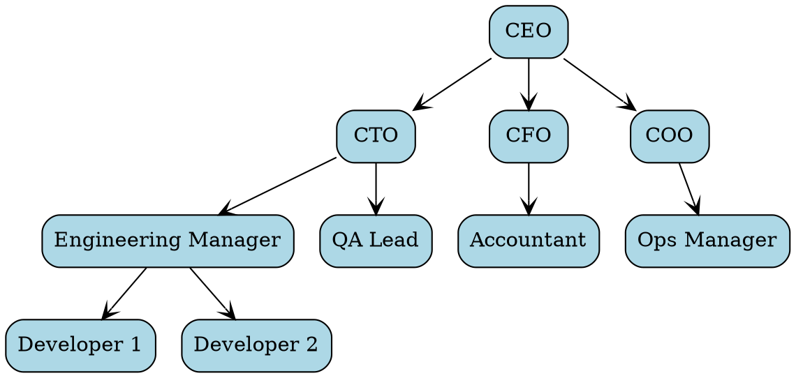
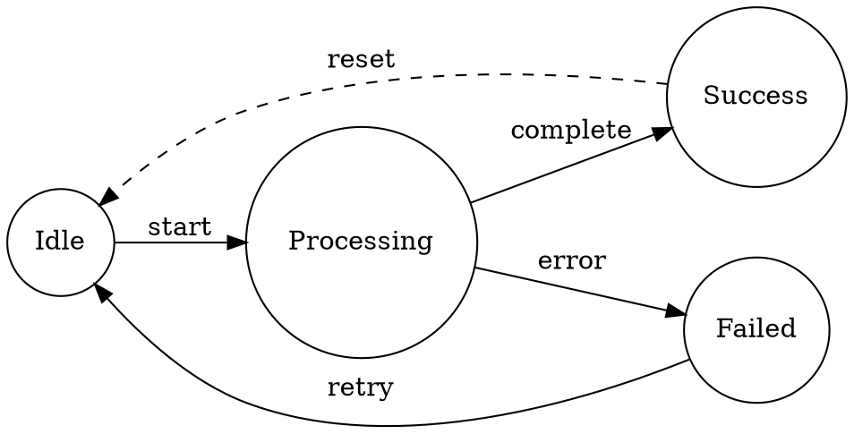
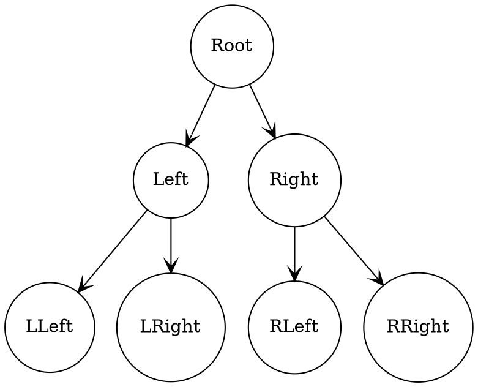
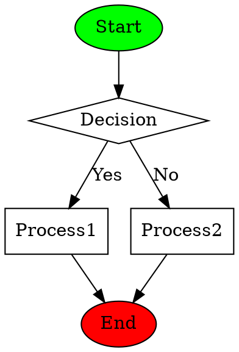
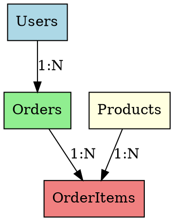
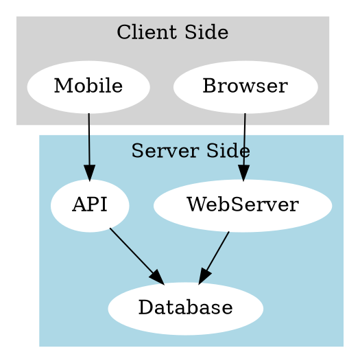
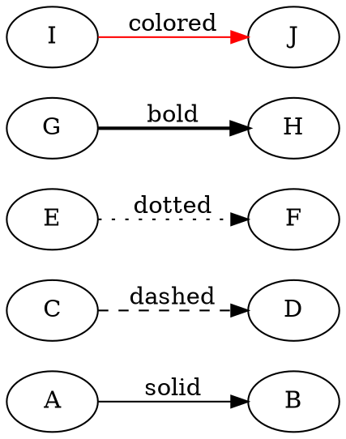

# Graphviz (DOT) Graph Examples

This document demonstrates various Graphviz DOT diagrams that you can use in BrowserMark.

## Directed Graph (digraph)

A simple directed graph showing relationships:



## Undirected Graph

An undirected graph using `graph` instead of `digraph`:



## Network Topology

A more complex network diagram:



## Organization Chart

Hierarchical structure with styling:



## State Machine

State transitions with labels:



## Binary Tree

Tree structure data structure:



## Flowchart with Decisions

Process flow with decision points:



## Database Schema

Entity relationships:



## Graph with Subgraphs

Grouping related nodes:



## Styled Edges

Different arrow styles:



## Tips for Using Graphviz

1. **Directed vs Undirected**: Use `digraph` for arrows (`->`) and `graph` for lines (`--`)
2. **Layout**: Control direction with `rankdir=LR` (left-right) or `rankdir=TB` (top-bottom)
3. **Shapes**: Available shapes include `box`, `ellipse`, `circle`, `diamond`, `box3d`, etc.
4. **Styling**: Add colors, styles, and labels to nodes and edges
5. **Subgraphs**: Use `subgraph` to group related nodes visually
6. **Rank**: Use `{rank=same; node1; node2;}` to align nodes at same level

### Language Identifiers

You can use either `dot` or `graphviz` as the language identifier:
- ````dot
  ```dot
  digraph G { ... }
  ```
  ````
- ````dot
  ```graphviz
  digraph G { ... }
  ```
  ````

For more information, visit the [Graphviz documentation](https://graphviz.org/documentation/).
