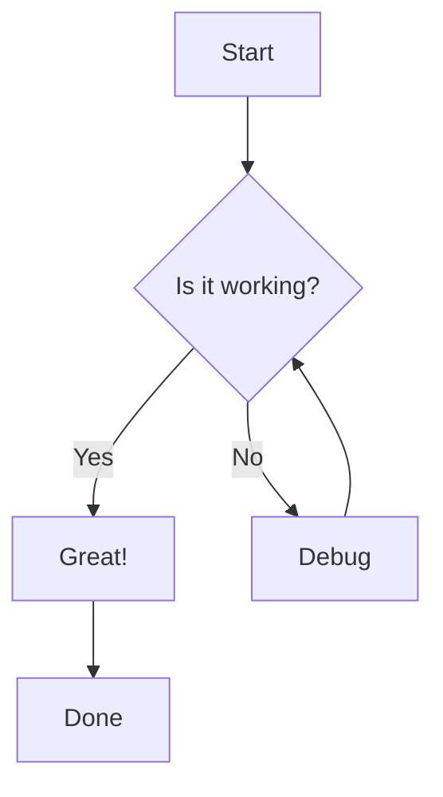
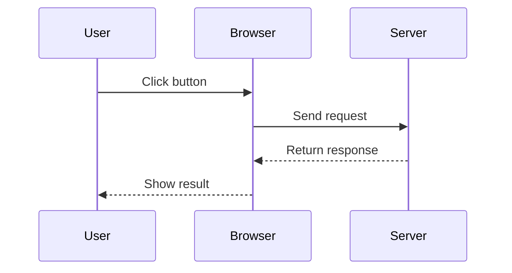
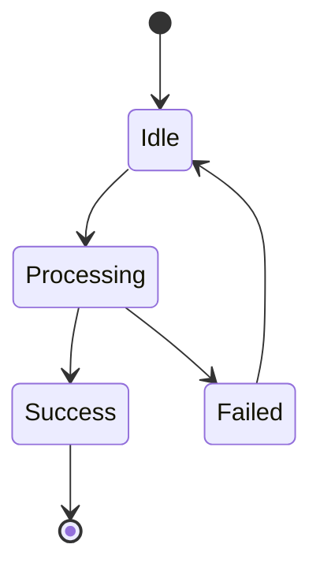
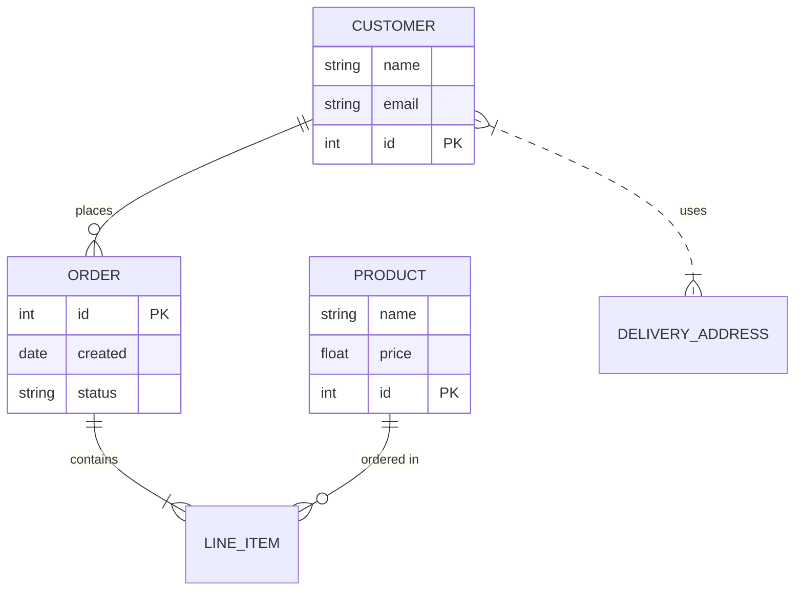
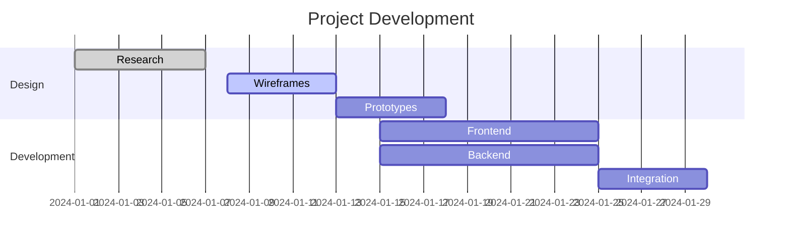
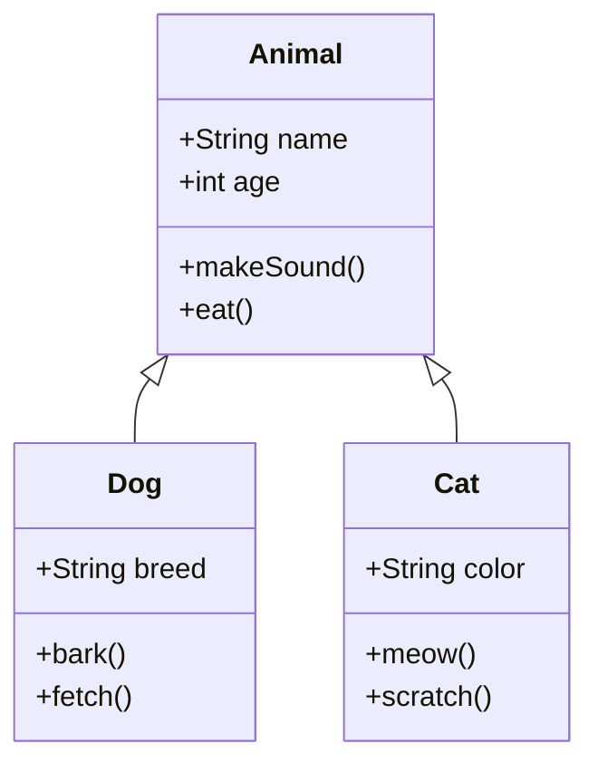
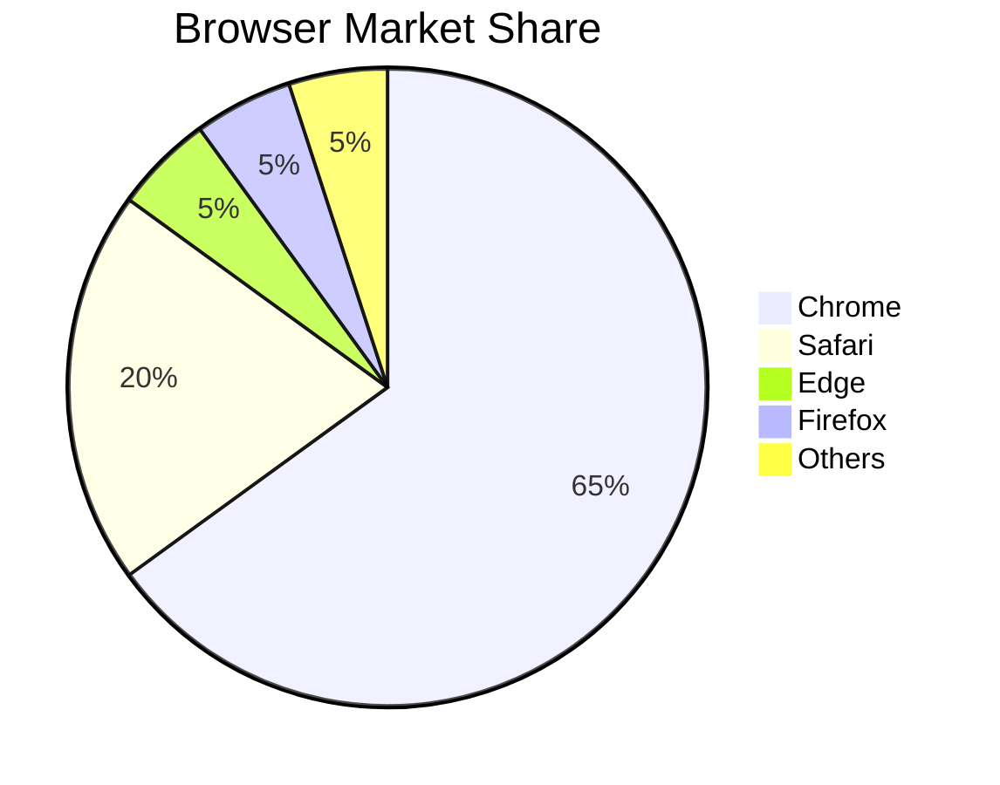
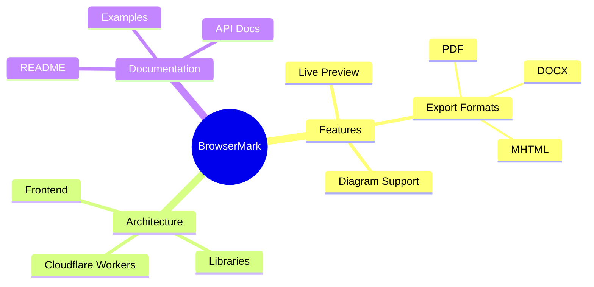

# Mermaid Flowchart Examples

This document demonstrates various Mermaid diagram types that you can use in BrowserMark.

## Simple Flowchart

A basic flowchart showing a decision process:

## Sequence Diagram

Interaction between users and systems:

## State Diagram

State transitions in a system:

## Entity Relationship Diagram

Database schema relationships:

## Gantt Chart

Project timeline:

## Class Diagram

Software architecture:

## Pie Chart

Data visualization:

## Mindmap

Hierarchical information:

## Tips for Using Mermaid

1. **Syntax**: Mermaid uses a simple text-based syntax
2. **Directions**: Use `TD` (top-down) or `LR` (left-right) for flowcharts
3. **Styling**: You can add custom styles with `classDef`
4. **Subgraphs**: Group related nodes with `subgraph`
5. **Testing**: Use the [Mermaid Live Editor](https://mermaid.live/) to test diagrams

For more information, visit the [Mermaid documentation](https://mermaid.js.org/intro/).
