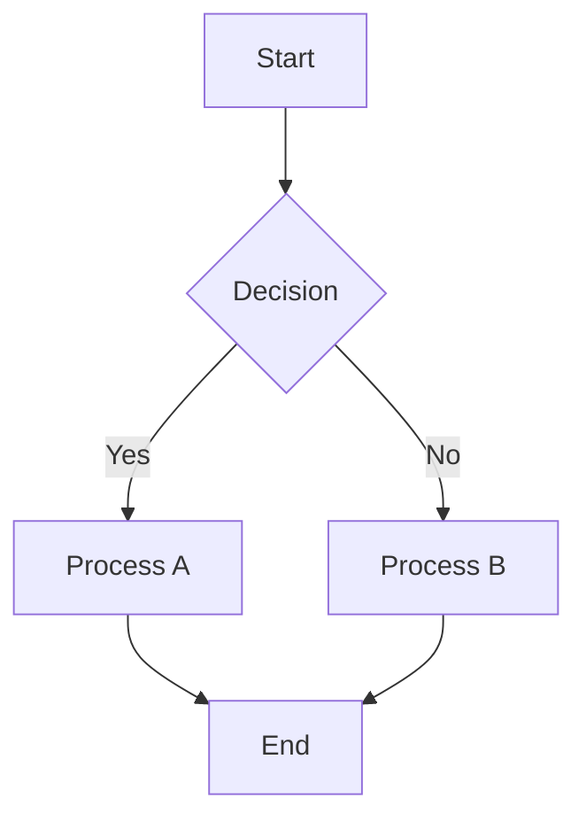
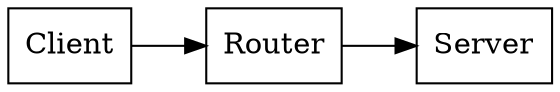
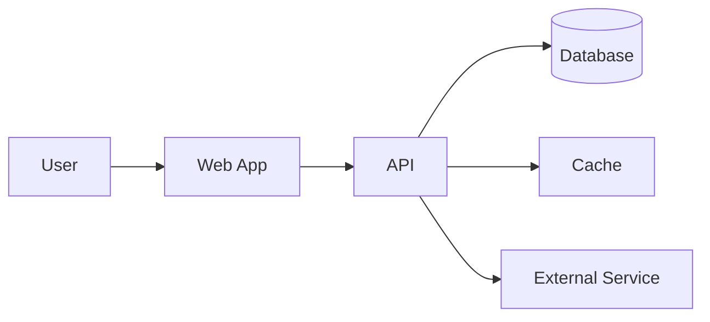
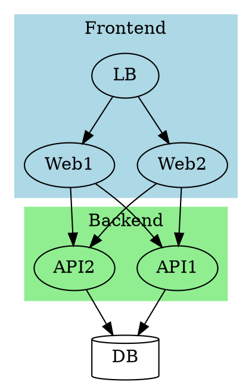
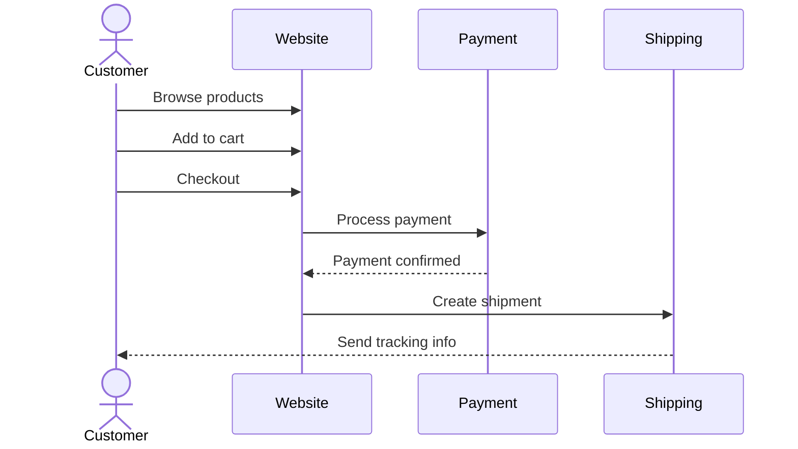
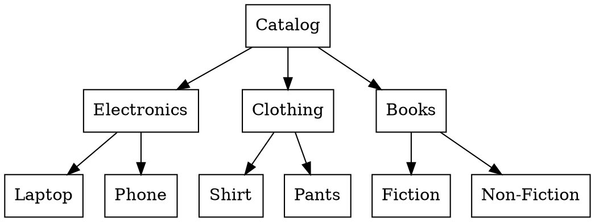
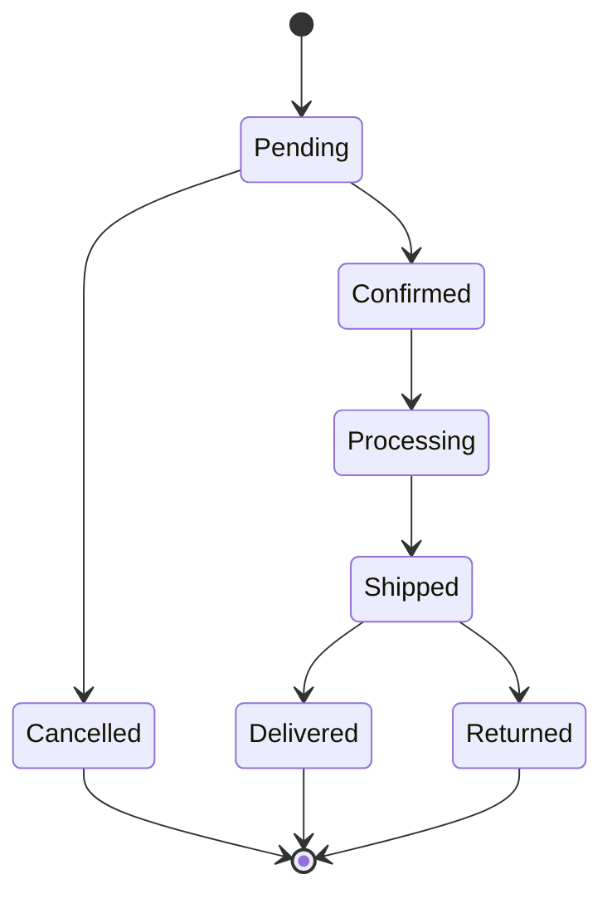

# Mixed Diagram Types Example

This document demonstrates how to use multiple diagram types in a single markdown document in BrowserMark.

## Introduction

BrowserMark supports four different diagramming languages, and you can mix them all in the same document. Each diagram type is optimized for different purposes:

- **Mermaid**: Flowcharts, sequence diagrams, Gantt charts, state diagrams
- **Graphviz (DOT)**: Network graphs, trees, hierarchical structures
- **Nomnoml**: UML class diagrams, simple box-and-arrow diagrams
- **Pikchr**: PIC-like technical diagrams, simple schematics

## Mermaid Flowchart Example

A simple decision process using Mermaid:



## Graphviz Network Example

A network topology using Graphviz DOT:



## Nomnoml UML Example

A class diagram using Nomnoml:

```nomnoml
[User|
  name: string
  email: string
  login()
  logout()
]

[User]->[Session]
[Session]->[Permission]
```

## Pikchr Technical Diagram Example

A simple process flow using Pikchr:

```pikchr
box "Start" width 1.0 cm
arrow
box "Process" width 1.5 cm
arrow
box "End" width 1.0 cm
```

## Complex Example: System Architecture

Let's design a complete system using multiple diagram types.

### System Overview (Mermaid)



### Class Structure (Nomnoml)

```nomnoml
[<frame>Application Architecture|
  [UserController]-->[UserService]
  [UserService]-->[UserRepository]
  [UserRepository]->[Database]

  [ProductController]-->[ProductService]
  [ProductService]-->[ProductRepository]
  [ProductRepository]->[Database]
]
```

### Network Topology (Graphviz)



### Data Flow (Pikchr)

```pikchr
box "Client" width 1.5 cm fill lightblue
arrow right 1.0 cm
box "Load Balancer" width 1.5 cm fill lightgreen
arrow right 1.0 cm
box "API Server" width 1.5 cm fill lightyellow
arrow right 1.0 cm
box "Database" width 1.5 cm fill lightcoral
```

## Real-World Example: E-commerce System

### User Journey (Mermaid Sequence Diagram)



### Product Catalog (Graphviz)



### Order Processing (Nomnoml)

```nomnoml
[OrderProcessor|
  processOrder()
  validatePayment()
  confirmOrder()
]

[OrderProcessor]down>[PaymentValidator]
[OrderProcessor]down>[InventoryManager]
[OrderProcessor]down>[ShippingService]

[PaymentValidator]-->[PaymentGateway]
[InventoryManager]-->[Warehouse]
[ShippingService]-->[Courier]
```

### Order States (Mermaid State Diagram)



### Physical Flow (Pikchr)

```pikchr
box "Warehouse" width 2.0 cm fill lightblue
arrow right 1.5 cm
box "Packaging" width 2.0 cm fill lightgreen
arrow right 1.5 cm
box "Shipping" width 2.0 cm fill lightyellow
arrow right 1.5 cm
box "Delivery" width 2.0 cm fill lightcoral
```

## Tips for Mixing Diagram Types

### Choose the Right Tool for the Job

1. **Mermaid** is best for:
   - Flowcharts and process flows
   - Sequence diagrams showing time-based interactions
   - State diagrams
   - Gantt charts for project timelines
   - Mindmaps

2. **Graphviz (DOT)** is best for:
   - Complex network topologies
   - Tree structures
   - Hierarchical data
   - Directed/undirected graphs
   - Automatic layout optimization

3. **Nomnoml** is best for:
   - UML class diagrams
   - Simple box-and-arrow diagrams
   - Architecture overviews
   - Quick sketches

4. **Pikchr** is best for:
   - Technical diagrams with precise positioning
   - Simple flow diagrams
   - PIC-style diagrams
   - When you need exact control over layout

### Consistency Tips

1. **Color scheme**: Try to use similar colors across different diagram types
2. **Labeling**: Use consistent naming conventions
3. **Complexity**: Don't mix very complex diagrams in the same section
4. **Purpose**: Each diagram type should serve a clear purpose in the document

### Performance Considerations

When using multiple diagrams in one document:

1. **Loading**: Each diagram library loads from CDN, so first render may be slower
2. **Caching**: After the first render, libraries are cached and subsequent renders are fast
3. **Complexity**: Very complex diagrams may take longer to render
4. **Timeout**: Default timeout is 30 seconds per diagram

## Testing Your Mixed Diagrams

1. **Test each diagram individually** first using the library's live editor
2. **Check language identifiers**: Ensure you're using the correct fence (```mermaid, ```dot, ```nomnoml, ```pikchr)
3. **Incremental addition**: Add diagrams one at a time to catch errors early
4. **Export testing**: Test PDF/DOCX export to ensure diagrams render correctly

## Live Editors for Testing

Before adding diagrams to your document, test them in these live editors:

- **Mermaid**: https://mermaid.live/
- **Graphviz**: https://dreampuf.github.io/GraphvizOnline/
- **Nomnoml**: http://www.nomnoml.com/
- **Pikchr**: https://pikchr.org/home/doc/trunk/doc/pikchr-lang.html

## Conclusion

Mixing different diagram types allows you to leverage the strengths of each tool. Use this flexibility to create comprehensive technical documentation that clearly communicates complex concepts.
